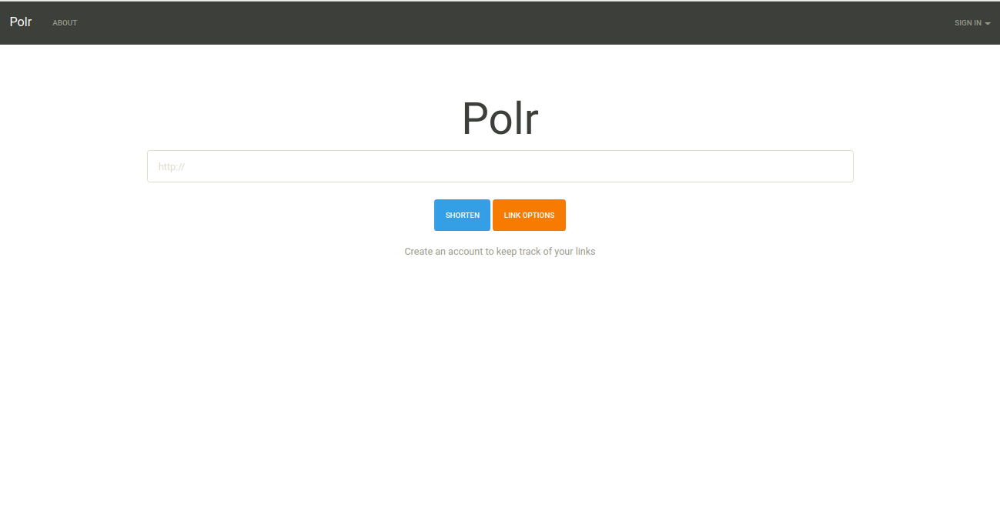

<!--
N.B.: This README was automatically generated by https://github.com/YunoHost/apps/tree/master/tools/README-generator
It shall NOT be edited by hand.
-->

# Polr pour YunoHost

[](https://dash.yunohost.org/appci/app/polr)    
[](https://install-app.yunohost.org/?app=polr)

*[Read this readme in english.](./README.md)*

> *Ce package vous permet d'installer Polr rapidement et simplement sur un serveur YunoHost.
Si vous n'avez pas YunoHost, regardez [ici](https://yunohost.org/#/install) pour savoir comment l'installer et en profiter.*

## Vue d'ensemble

Polr is a beautiful, modern, lightweight, and minimalist open-source URL shortening application. It allows you to host your own URL shortener, to brand your URLs, and to gain control over your data. Polr is especially easy to use, and provides a modern, themable interface.

**Version incluse :** 2.3.0~ynh1

**Démo :** https://demo.polr.me/

## Captures d'écran



## Documentations et ressources

* Site officiel de l'app : <https://polrproject.org/>
* Documentation officielle utilisateur : <https://docs.polrproject.org/en/latest/>
* Dépôt de code officiel de l'app : <https://github.com/cydrobolt/polr/>
* Documentation YunoHost pour cette app : <https://yunohost.org/app_polr>
* Signaler un bug : <https://github.com/YunoHost-Apps/polr_ynh/issues>

## Informations pour les développeurs

Merci de faire vos pull request sur la [branche testing](https://github.com/YunoHost-Apps/polr_ynh/tree/testing).

Pour essayer la branche testing, procédez comme suit.

``` bash
sudo yunohost app install https://github.com/YunoHost-Apps/polr_ynh/tree/testing --debug
ou
sudo yunohost app upgrade polr -u https://github.com/YunoHost-Apps/polr_ynh/tree/testing --debug
```

**Plus d'infos sur le packaging d'applications :** <https://yunohost.org/packaging_apps>
